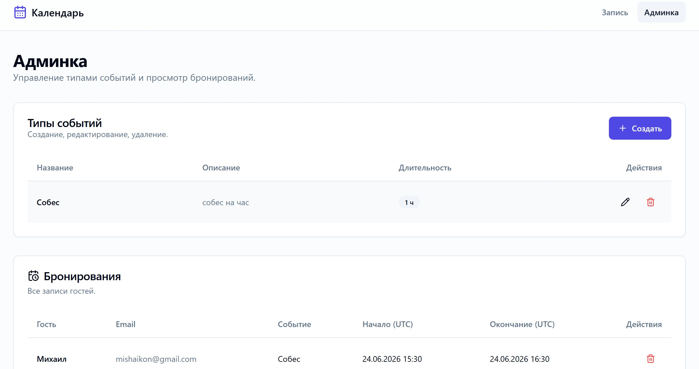
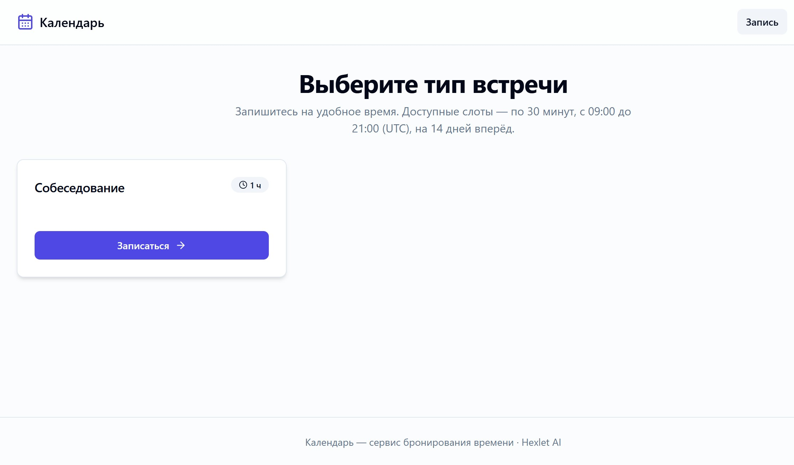
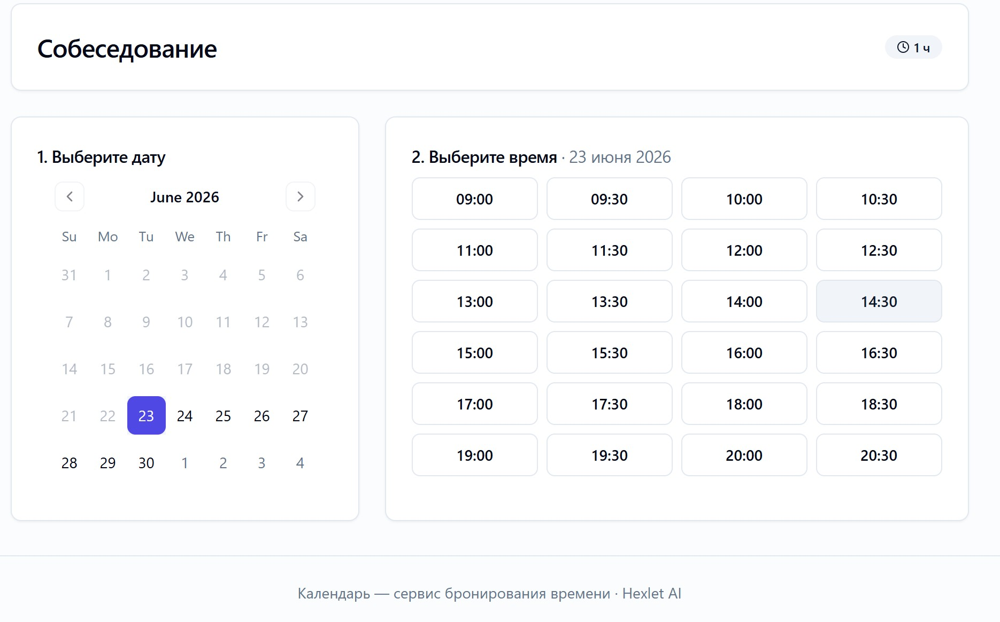
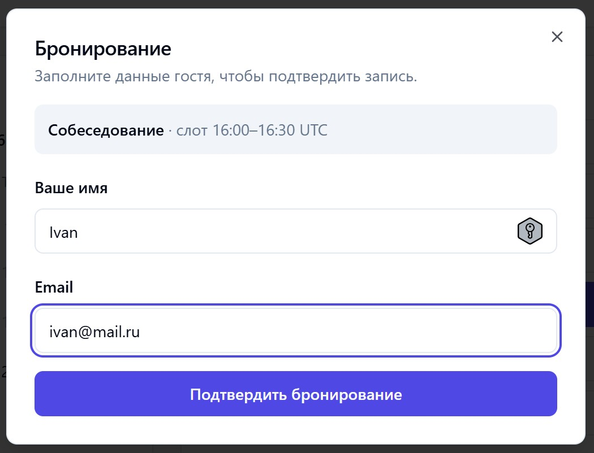
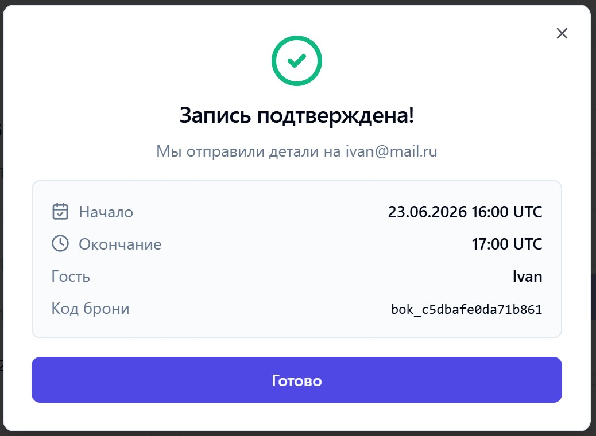

# 📅 Календарь — Сервис бронирования времени

Сервис для бронирования времени по мотивам [Cal.com](https://cal.com).

Проект разработан в рамках курса [**Hexlet AI для разработчиков**](https://ru.hexlet.io/programs/ai-for-developers).

### Hexlet tests and linter status:
[](https://github.com/nujensait/ai-for-developers-project-386/actions)

---

## 📑 Оглавление

- [🎯 О проекте](#-о-проекте)
- [🧱 Технологический стек](#-технологический-стек)
- [📂 Структура проекта](#-структура-проекта)
- [🚀 Быстрый старт](#-быстрый-старт)
- [📖 API Документация](#-api-документация)
- [🧪 Тестирование](#-тестирование)
- [🛠️ Команды Makefile](#️-команды-makefile)
- [🔧 Контракт API (Design-First)](#-контракт-api-design-first)
- [🤖 Разработка с ИИ-агентами](#-разработка-с-ии-агентами)
- [📖 Скриншоты](#-скриншоты)
- [📋 План развития](#-план-развития)
- [📝 Лицензия](#-лицензия)
- [🙏 Автор](#-автор)

---

## 🎯 О проекте

Упрощённый сервис бронирования времени. Владелец календаря публикует типы событий
(длительность встреч), а гости выбирают свободные слоты и записываются.

### Ключевые возможности

- **Типы событий (event types):** CRUD — название, описание, длительность.
- **Доступность (availability):** сетка 30-минутных слотов, 09:00–21:00, на 14 дней вперёд.
- **Бронирования (bookings):** создание/просмотр/удаление; один слот — одна запись.

### Бизнес-правила

- Пересечение по времени с существующей бронью → `409 Conflict`.
- Все даты — в UTC (ISO 8601, `...Z`).
- Данные хранятся в **SQLite** и сохраняются между перезапусками.

---

## 🧱 Технологический стек

| Компонент | Технологии |
|-----------|------------|
| **Бэкенд** | Symfony 7.2, PHP 8.3 |
| **Хранилище** | SQLite + Doctrine ORM (миграции) |
| **API-контракт** | TypeSpec → OpenAPI 3.1 |
| **Документация** | Swagger UI (`/api/doc`) на основе сгенерированного OpenAPI |
| **Тестирование** | PHPUnit (WebTestCase) |
| **Контейнеризация** | Docker + Docker Compose |
| **Сервер** | встроенный веб-сервер PHP (`php -S`) |

> Реализация использует нативный стек Symfony (атрибут-роутинг + Validator + JsonResponse)
> вместо FOSRest/JMS/Nelmio — это уменьшает число зависимостей и риски сборки.
> Подробности отклонений от исходного ТЗ — в `doc/PLAN.md` и `doc/WORK_LOG.md`.

---

## 📂 Структура проекта

```
calendar/
├── typespec/main.tsp          # Контракт API (TypeSpec)
├── openapi/schema/openapi.yaml# Сгенерированный OpenAPI 3.1
├── backend/                   # Symfony API
│   ├── config/                # Конфигурация (framework, doctrine, routes, services)
│   ├── public/index.php       # Точка входа + openapi.yaml для Swagger UI
│   ├── migrations/            # Doctrine-миграции
│   ├── src/
│   │   ├── Controller/        # EventType, Booking, Doc
│   │   ├── DTO/               # Объекты запросов/ответов
│   │   ├── Entity/            # Doctrine-сущности
│   │   ├── EventSubscriber/   # CORS, обработка ошибок → JSON
│   │   ├── Exception/         # ConflictException, NotFoundException
│   │   ├── Repository/        # Doctrine-репозитории
│   │   └── Service/           # Бизнес-логика
│   ├── tests/                 # PHPUnit
│   ├── docker/                # php.ini, entrypoint.sh
│   └── Dockerfile
├── docker-compose.yml
├── Makefile
└── package.json               # TypeSpec-зависимости и скрипт generate:api
```

---

## 🚀 Быстрый старт (Docker)

> Требуется Docker и Docker Compose. Приложение слушает порт **8081** (переменная `PORT`).

```bash
# 1. Собрать образ
docker-compose build

# 2. Запустить
docker-compose up -d

# 3. Проверить API
curl http://localhost:8081/api/event-types
# -> []
```

Доступно после запуска:
- **API:** `http://localhost:8081`
- **Документация (Swagger UI):** `http://localhost:8081/api/doc`
- **OpenAPI:** `http://localhost:8081/api/openapi.yaml`

Сменить порт: `PORT=9090 docker-compose up -d` (или `make up PORT=9090`).

### Через Makefile

```bash
make build         # сборка образа
make up            # запуск (docker-compose up -d)
make test          # запуск PHPUnit в контейнере
make generate-api  # TypeSpec -> OpenAPI и копирование в backend
make logs          # логи бэкенда
make down          # остановка
```

---

## 📖 API

| Метод | Эндпоинт | Описание |
|-------|----------|----------|
| `GET` | `/api/event-types` | Список типов событий |
| `POST` | `/api/event-types` | Создать тип события |
| `GET` | `/api/event-types/{id}` | Получить тип события |
| `PUT` | `/api/event-types/{id}` | Обновить тип события |
| `DELETE` | `/api/event-types/{id}` | Удалить тип события |
| `GET` | `/api/availability` | Свободные слоты (`?eventTypeId=&from=&to=`) |
| `GET` | `/api/bookings` | Список бронирований |
| `POST` | `/api/bookings` | Создать бронирование |
| `GET` | `/api/bookings/{id}` | Получить бронирование |
| `DELETE` | `/api/bookings/{id}` | Удалить бронирование |

### Пример: создать тип события

```bash
curl -X POST http://localhost:8081/api/event-types \
  -H "Content-Type: application/json" \
  -d '{"title":"Интро-звонок","description":"Знакомство","duration":30}'
```

```json
{ "id": "evt_1a2b3c4d5e6f7a8b", "title": "Интро-звонок", "description": "Знакомство", "duration": 30 }
```

### Пример: создать бронирование

```bash
curl -X POST http://localhost:8081/api/bookings \
  -H "Content-Type: application/json" \
  -d '{
    "eventTypeId": "evt_1a2b3c4d5e6f7a8b",
    "guestName": "Иван Петров",
    "guestEmail": "ivan@example.com",
    "startTime": "2026-06-25T10:00:00Z"
  }'
```

```json
{
  "id": "bok_9f8e7d6c5b4a3210",
  "eventTypeId": "evt_1a2b3c4d5e6f7a8b",
  "guestName": "Иван Петров",
  "guestEmail": "ivan@example.com",
  "startTime": "2026-06-25T10:00:00Z",
  "endTime": "2026-06-25T10:30:00Z",
  "createdAt": "2026-06-22T17:00:00Z"
}
```

### Формат ошибок

```json
{ "code": "CONFLICT", "message": "The requested time slot is already booked" }
```

Коды: `VALIDATION_ERROR` (400), `NOT_FOUND` (404), `CONFLICT` (409).

---

## 🧪 Тестирование

```bash
make test
# или напрямую:
docker-compose run --rm -e APP_ENV=test backend php bin/phpunit
```

Тесты используют отдельную БД (`var/test.db`); схема пересоздаётся перед каждым тестом.

---

## 🛠️ Команды Makefile

Проект использует Makefile для упрощения работы. Все команды запускаются через `make <команда>`.

**Просмотр всех доступных команд:**

```bash
make help
```

### Основные команды

| Команда | Описание |
|---------|----------|
| `make setup` | Начальная настройка проекта (установка зависимостей + сборка образов) |
| `make install` | Установить зависимости backend + frontend |
| `make build` | Собрать Docker-образы (backend + frontend) |
| `make up` / `make dev` | Запустить весь стек в фоновом режиме |
| `make down` | Остановить и удалить контейнеры |
| `make stop` | Остановить контейнеры без удаления |

### Логи и отладка

| Команда | Описание |
|---------|----------|
| `make logs` | Просмотр логов всех сервисов |
| `make logs-backend` | Просмотр логов backend |
| `make logs-frontend` | Просмотр логов frontend |
| `make shell` | Открыть shell в контейнере backend |

### Тестирование и проверка

| Команда | Описание |
|---------|----------|
| `make test` | Запустить PHPUnit тесты backend |
| `make curl-check` | Быстрая проверка API (smoke test) |

### Разработка

| Команда | Описание |
|---------|----------|
| `make install-backend` | Установить PHP зависимости (Composer) |
| `make install-frontend` | Установить npm зависимости |
| `make frontend-dev` | Запустить Vite dev-сервер локально (без Docker) |
| `make frontend-build` | Собрать frontend для production |
| `make generate-api` | Сгенерировать OpenAPI из TypeSpec |

### Деплой

| Команда | Описание |
|---------|----------|
| `make deploy` | Полный деплой (generate-api + build + up) |

### Примеры использования

```bash
# Первый запуск проекта
make setup
make up

# Просмотр логов
make logs-backend

# Запуск тестов
make test

# Остановка проекта
make down
```

---

## 🔧 Контракт API (Design-First)

```bash
# Сгенерировать OpenAPI из TypeSpec (нужен Node.js 22)
npm install
npm run generate:api      # -> openapi/schema/openapi.yaml
```

`make generate-api` дополнительно копирует спецификацию в `backend/public/openapi.yaml`,
откуда её читает Swagger UI на `/api/doc`.

---

## 🗄️ Хранилище и порт

- **SQLite:** `DATABASE_URL="sqlite:///%kernel.project_dir%/var/data.db"`. В Docker файл лежит
  в томе `calendar_data`, поэтому данные переживают `docker-compose down/up`.
- При старте контейнера схема создаётся автоматически (миграции + `doctrine:schema:update`).
- **Порт:** по умолчанию `8081`, задаётся переменной `PORT`.

---

## 📋 Скриншоты

- Админка


- Запись: выбор типа встречи
  

- Запись: выбор даты/времени встречи
  

- Запись: ввод личных данных
  

- Запись: подтверждение
  

---

## 📋 План развития

- [x] Базовый сценарий бронирования (event types, availability, bookings)
- [ ] Фронтенд (React/Vite)
- [ ] E2E-тесты (Playwright)
- [ ] CI/CD (GitHub Actions, release-please)
- [ ] Таймзоны, аккаунты, уведомления

---

## 📝 Лицензия

MIT © [Hexlet](https://hexlet.io)

## 🔧 Автор

- Иконников Михаил <mishaikon@gmail.com>, OpenCode (Claude Opus 4.7)
